# Observe System Map

Complete architecture reference: database ERD, user flows, Stripe integration, and API surface.

---

## Entity Relationship Diagram

```mermaid
erDiagram
    users {
        serial id PK
        text email UK
        text visitor_id UK
        text stripe_customer_id
        text stripe_plan
        timestamptz created_at
    }

    accounts {
        serial id PK
        text name
        text stripe_customer_id
        text stripe_plan
        text clerk_org_id UK
        timestamptz created_at
    }

    user_accounts {
        serial id PK
        integer user_id FK
        integer account_id FK
        text role
        text status
    }

    customers {
        serial id PK
        text user_id
        integer account_id FK
        text customer_id
        text name
        text email
        text stripe_customer_id
        boolean is_internal
    }

    observe_events {
        serial id PK
        text user_id
        integer account_id FK
        text customer_id
        text feature_key
        text event_name
        timestamptz timestamp
        numeric cost_amount
        numeric revenue_amount
        numeric usage_units
        integer input_tokens
        integer output_tokens
        text model
        text model_provider
        text source
        text revenue_source
        text trace_id
        text span_id
        text parent_span_id
        integer duration_ms
        text cost_type
        jsonb request_body
        jsonb response_body
        jsonb properties
        jsonb meta
        text idempotency_key
    }

    subscriptions {
        serial id PK
        text user_id
        integer account_id FK
        text subscription_id
        text customer_id
        text plan_id
        boolean is_active
        numeric mrr_override
        text pricing_model
        jsonb pricing_tiers
        numeric unit_price
    }

    plans {
        serial id PK
        text user_id
        integer account_id FK
        text plan_id
        text name
        numeric price_amount
        integer interval_months
        text billing_model
    }

    feature_definitions {
        serial id PK
        text user_id
        integer account_id FK
        text feature_key
        text name
        text kind
    }

    feature_pricing {
        serial id PK
        text user_id
        integer account_id FK
        text feature_key
        numeric revenue_per_unit
        text unit_label
    }

    integrations {
        serial id PK
        text user_id
        integer account_id FK
        text provider
        text api_key_prefix
        text encrypted_api_key
        boolean has_usage_access
        text stripe_account_id
        text stripe_account_name
        timestamptz last_synced_at
    }

    sdk_api_keys {
        serial id PK
        text user_id
        integer account_id FK
        text key_hash UK
        text key_prefix
        text name
        timestamptz revoked_at
    }

    alert_rules {
        serial id PK
        text user_id
        integer account_id FK
        text name
        text metric
        text operator
        numeric threshold
        boolean enabled
        text trigger_type
        text segment_type
    }

    alert_history {
        serial id PK
        text user_id
        integer account_id FK
        integer alert_rule_id FK
        text customer_id
        text trigger_type
        numeric current_value
        timestamptz fired_at
    }

    custom_cohorts {
        serial id PK
        text user_id
        integer account_id FK
        text name
        text cohort_type
        jsonb rules
    }

    cohort_members {
        serial id PK
        integer cohort_id FK
        text customer_id
    }

    routing_configs {
        serial id PK
        text user_id
        integer account_id FK
        text name
        boolean is_active
    }

    routing_targets {
        serial id PK
        integer config_id FK
        text provider
        text model
        integer priority
        integer weight
    }

    routing_rules {
        serial id PK
        integer config_id FK
        integer target_id FK
        text field
        text operator
        text value
    }

    proxy_cache {
        serial id PK
        text user_id
        integer account_id FK
        text cache_key
        text model
        jsonb response_body
        integer tokens_saved
    }

    simulations {
        serial id PK
        text user_id
        integer account_id FK
        text name
        jsonb scenarios
        jsonb results
        text status
    }

    recommendations {
        serial id PK
        text user_id
        integer account_id FK
        text type
        text title
        text action_type
        jsonb action_payload
        text status
    }

    ai_insights {
        serial id PK
        text user_id
        integer account_id FK
        text insight_type
        text title
        text severity
        integer tokens_used
    }

    customer_health_snapshots {
        serial id PK
        text user_id
        integer account_id FK
        text customer_id
        integer health_score
        date snapshot_date
    }

    users ||--o{ user_accounts : "has"
    accounts ||--o{ user_accounts : "has"
    accounts ||--o{ customers : "owns"
    accounts ||--o{ observe_events : "owns"
    accounts ||--o{ subscriptions : "owns"
    accounts ||--o{ plans : "owns"
    accounts ||--o{ feature_definitions : "owns"
    accounts ||--o{ feature_pricing : "owns"
    accounts ||--o{ integrations : "owns"
    accounts ||--o{ sdk_api_keys : "owns"
    accounts ||--o{ alert_rules : "owns"
    accounts ||--o{ custom_cohorts : "owns"
    accounts ||--o{ routing_configs : "owns"
    accounts ||--o{ simulations : "owns"
    accounts ||--o{ recommendations : "owns"
    accounts ||--o{ ai_insights : "owns"
    customers }o--o{ observe_events : "customer_id"
    customers }o--o{ subscriptions : "customer_id"
    customers }o--o{ customer_health_snapshots : "customer_id"
    customers }o--o{ cohort_members : "customer_id"
    subscriptions }o--|| plans : "plan_id"
    alert_rules ||--o{ alert_history : "fires"
    custom_cohorts ||--o{ cohort_members : "contains"
    routing_configs ||--o{ routing_targets : "has"
    routing_configs ||--o{ routing_rules : "has"
    routing_rules }o--|| routing_targets : "routes to"
    feature_definitions }o--o{ observe_events : "feature_key"
    feature_pricing }o--o{ feature_definitions : "feature_key"
```



---

## Multi-Tenant Data Model

All data tables have `account_id` (FK to accounts). A user can belong to multiple accounts via `user_accounts`. Every query scopes by `account_id`.

```
User (Clerk auth)
  └── user_accounts (role: owner | admin | viewer)
        └── Account
              ├── observe_events (core event log)
              ├── customers (from Stripe sync or SDK)
              ├── subscriptions (from Stripe sync)
              ├── plans (from Stripe sync)
              ├── integrations (Stripe, OpenAI, Anthropic keys)
              ├── sdk_api_keys (for event ingest)
              ├── feature_definitions (auto-detected from events)
              ├── feature_pricing (revenue per unit)
              ├── alert_rules → alert_history
              ├── custom_cohorts → cohort_members
              ├── routing_configs → routing_targets, routing_rules
              └── simulations, recommendations, ai_insights
```

---

## Page Routes & Purpose

| Path | Page | What it does |
|------|------|--------------|
| `/analytics` | AnalyticsPage | Main dashboard: events by feature/model/customer/agent, MRR movements |
| `/events` | EventsPage | Event log with filters (feature, customer, model, source, date) |
| `/features` | FeaturesPage | Auto-detected features, edit names, set per-feature pricing |
| `/models` | ModelsPage | Model breakdown: cost, revenue, usage by model/provider |
| `/cohorts` | CohortsPage | Auto-discovered segments + custom cohorts |
| `/customers/:id` | CustomerDetailPage | Single customer: subscriptions, events, margin, health |
| `/data-sources` | DataSourcesPage | SDK keys, integrations (Stripe/OpenAI/Anthropic), CSV upload |
| `/alerts` | AlertsPage | Alert rules and firing history |
| `/traces` | TracesPage | Distributed trace/span viewer |
| `/plans` | PlansPage | Pricing plans and usage limits |
| `/team` | TeamSettingsPage | Team members, invites, rename |
| `/admin` | AdminPage | Internal admin (restricted) |

---

## User Journeys

### A. Onboarding: New User → First Data

```
1. Signup via Clerk (/login)
2. Redirect to /analytics (sees empty state)
3. Navigate to /data-sources
4. Generate SDK key → copy key
5. Integrate SDK: POST /api/events/ingest with Bearer token
6. Optional: Connect Stripe → syncs customers, subscriptions, plans
7. Optional: Connect OpenAI/Anthropic → tracks provider costs
8. Events flow in → dashboard populates
```

### B. Daily Usage: Check Margins

```
1. Open /analytics → see cost/revenue/margin by feature
2. Spot high-cost feature → click → /features detail
3. See which model drives cost → click model → /events?model=gpt-4o
4. Drill into customer → /customers/:id → see P&L breakdown
5. AI recommends model swap → /recommendations → apply
```

### C. Stripe Revenue Attribution

```
1. Connect Stripe API key on /data-sources
2. Sync pulls: customers, subscriptions, plans with pricing model detection
3. SDK event arrives with customerReferenceId matching Stripe customer
4. Revenue enrichment at ingest:
   - Metered: unitPrice x usageUnits
   - Tiered: tierUnitPrice(mtdUsage) x usageUnits
   - Flat: $0 per event (MRR is fixed)
5. Event stored with revenue_amount and revenue_source
6. Dashboard shows margin = (revenue - cost) / revenue
```

### D. Alert Setup

```
1. Open /alerts → create rule
2. Pick trigger: daily cost > $100, or margin < 20%, or per-customer
3. Server evaluates on each event ingest
4. If threshold hit → fires alert → stores in alert_history
5. Optional: email or webhook notification
```

---

## Stripe Integration Flow

### Connection
```
User enters API key → POST /integrations/stripe/connect
  → Validates key format (rk_live_, sk_live_, etc.)
  → Calls stripe.accounts.retrieve() for account info
  → Encrypts key (AES-256-GCM) → stores in integrations table
  → Triggers initial sync
```

### Sync (syncStripeDataForUser)
```
Fetch from Stripe API:
  → Products + Prices → plans table
  → Customers (up to 10k) → customers table
  → Subscriptions (up to 10k) → subscriptions table
    → Detect pricing_model per subscription:
       flat: per_unit + licensed
       metered: usage_type=metered
       tiered: billing_scheme=tiered
       hybrid: mix of above
    → Calculate MRR for flat subscriptions
    → Store pricing_tiers and unit_price for metered/tiered
```

### Revenue Enrichment at Ingest
```
SDK event arrives → POST /events/ingest
  → Revenue priority:
     1. Explicit revenue_amount in event (highest)
     2. Feature pricing rule (feature_pricing table)
     3. Stripe subscription match:
        - metered → unitPrice x usageUnits (revenue_source: per_unit)
        - tiered → tierPrice(mtdUsage) x usageUnits (revenue_source: tiered)
        - hybrid → metered component if available (revenue_source: hybrid)
        - flat → $0 per event (revenue_source: subscription)
     4. Default $0 (revenue_source: none)
```

### Customer Name Resolution
```
Event has cus_* customer ID → async after ingest response:
  → Identifies unresolved customers (name = customer_id)
  → Calls stripe.customers.retrieve(cus_id)
  → Updates customers table with real name + email
```

### Where Stripe Breaks

| Failure | Impact | Fix |
|---------|--------|-----|
| Customer ID mismatch (SDK sends "acme" but Stripe has "cus_abc") | Revenue = $0 | Use `meta.stripe_customer_id` to map |
| Subscription not synced before events arrive | Revenue = $0 | Re-sync via POST /integrations/stripe/sync |
| API key revoked | Sync fails silently | Reconnect with new key |
| Complex pricing (graduated tiers, multi-currency) | MRR inaccurate | Check pricing_tiers in subscriptions table |
| Webhook secret mismatch | Plan upgrades not reflected | Update STRIPE_WEBHOOK_SECRET env var |

### Diagnostic Endpoints
- `GET /integrations/stripe/status` — connection state, last sync time
- `GET /integrations/stripe/diagnostics` — unresolved customers, events missing revenue, subscription breakdown

---

## API Surface Summary

### Event Ingest
| Endpoint | Method | Auth | Purpose |
|----------|--------|------|---------|
| `/events/ingest` | POST | SDK key | Ingest events (batch up to 1000) |
| `/events` | GET | Clerk | Query events with filters |
| `/events/:id` | GET | Clerk | Event detail with request/response bodies |
| `/events/traces` | GET | Clerk | List distributed traces |
| `/events/trace/:id` | GET | Clerk | Trace detail with all spans |

### Analytics
| Endpoint | Method | Purpose |
|----------|--------|---------|
| `/metrics/summary` | GET | Total customers, MRR, ARR, ARPC |
| `/metrics/source-breakdown` | GET | Events and cost by source |
| `/analytics/customer-pnl` | GET | Per-customer P&L |
| `/analytics/margin-trends` | GET | Monthly margin % |
| `/analytics/mrr-movements` | GET | Churn, expansion, contraction |
| `/analytics/retention-cohorts` | GET | Cohort retention tables |

### Integrations
| Endpoint | Method | Purpose |
|----------|--------|---------|
| `/integrations/stripe/connect` | POST | Connect Stripe API key |
| `/integrations/stripe/sync` | POST | Re-sync Stripe data |
| `/integrations/stripe/disconnect` | DELETE | Remove Stripe connection |
| `/integrations/stripe/status` | GET | Connection status |
| `/integrations/stripe/diagnostics` | GET | Health checks |
| `/integrations/openai/connect` | POST | Connect OpenAI |
| `/integrations/anthropic/connect` | POST | Connect Anthropic |

### LLM Proxy & Gateway
| Endpoint | Method | Purpose |
|----------|--------|---------|
| `/v1/chat/completions` | POST | OpenAI-compatible proxy |
| `/v1/messages` | POST | Anthropic Messages proxy |
| `/v1/embeddings` | POST | Embedding proxy |
| `/gateway/configs` | GET/POST | Routing configurations |

### SDK Management
| Endpoint | Method | Purpose |
|----------|--------|---------|
| `/sdk-keys` | GET/POST | List/create SDK keys |
| `/sdk-keys/:id` | DELETE | Revoke key |

---

## Changelog (2026-04-22)

### Events page filters fixed
- Dropdown filters (feature, customer, model, source) were broken — Vue compiled the HOF `onSelectUpdate` as an inline handler, discarding the returned function. Pre-created named handlers so Vue uses them directly.

### Event detail expansion: error surfacing
- Silent catch in `toggleEvent` swallowed all `getEventDetail` failures. Now logs errors, shows the actual message, and retries on re-expand.
- List query switched from `SELECT oe.*` to explicit columns, excluding large `request_body`/`response_body` JSONB from the 50-event list payload.

### Stripe customer enrichment pipeline
- **`stripe_customer_id` column added to `customers` table** — direct link between app customer IDs and Stripe customer IDs. Populated from Stripe sync, SDK ingest (`meta.stripe_customer_id`), and backfill.
- **Auto-create customer records during ingest** — events now create customer records on insert (like `feature_definitions`), using `ON CONFLICT DO NOTHING` to preserve Stripe-synced names.
- **`resolveStripeCustomerNames` expanded** — uses `stripe_customer_id` column directly instead of scanning events. Handles both `cus_*` IDs and `meta.stripe_customer_id` mapping.

### Revenue backfill
- **`POST /backfill/revenue`** — re-enriches existing events with `revenue_source=none` using current subscription data and feature pricing. Also resolves missing customer names from Stripe.
- **Auto-runs after Stripe sync** — `syncStripeDataForUser` now calls `runRevenueBackfill` after pulling customers/subscriptions/plans, so existing events get revenue attribution immediately.

### Docs
- `requestBody` and `responseBody` promoted to RECOMMENDED tier in `llms.txt` and added to the curl example so users include them by default.
